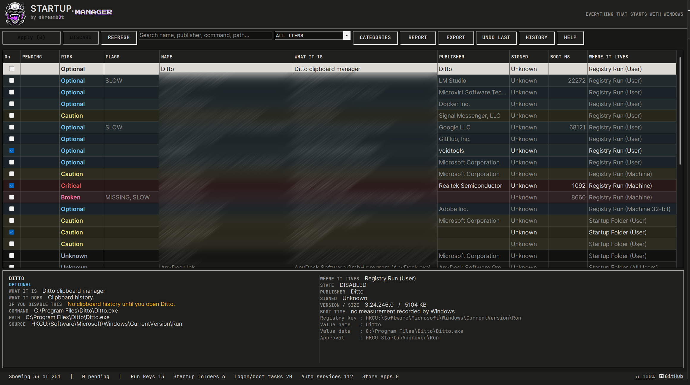
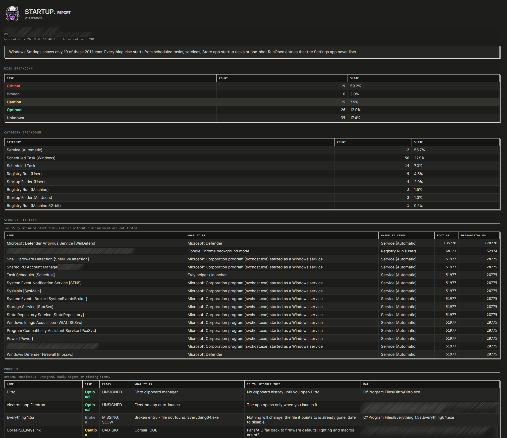

# Windows Startup App Manager

**Manage Windows startup programs, apps, scheduled tasks, and automatic services.**

[MIT license](LICENSE) · [Contributing](CONTRIBUTING.md)

**[Download the Windows installer](https://github.com/StarskreamEXE/Windows-Startup-App-Manager/releases)**

```text
███████╗████████╗ █████╗ ██████╗ ████████╗██╗   ██╗██████╗
██╔════╝╚══██╔══╝██╔══██╗██╔══██╗╚══██╔══╝██║   ██║██╔══██╗
███████╗   ██║   ███████║██████╔╝   ██║   ██║   ██║██████╔╝
╚════██║   ██║   ██╔══██║██╔══██╗   ██║   ██║   ██║██╔═══╝
███████║   ██║   ██║  ██║██║  ██║   ██║   ╚██████╔╝██║
╚══════╝   ╚═╝   ╚═╝  ╚═╝╚═╝  ╚═╝   ╚═╝    ╚═════╝ ╚═╝

              . m a n a g e r .
         boot · launch · monitor · recover
                by skreamb0t
```

**Windows Startup App Manager** is a Windows 10 and Windows 11 desktop utility for
viewing, enabling, and disabling startup apps and programs. It brings registry Run keys,
startup folders, logon and boot scheduled tasks, automatic services, and Store app
startup tasks into one interface, with read-only visibility into RunOnce entries.

See what each startup entry does in plain English. Stage changes, review them, and
apply them together, with mandatory recovery snapshots, verified results, change history,
and undo for individual changes or the last Apply batch.

Runs on **Windows PowerShell 5.1 + WinForms** with no Python, Node.js, or package manager
required. No background service or telemetry. You can install it with desktop shortcuts
or launch it directly from its folder; browser links open only when you click them.

## Screenshots

### Windows startup app management interface

Review startup programs, risk ratings, publishers, boot timings, and entry details.



### Generated Windows startup report

Generate a standalone HTML report with risk and category breakdowns, slowest starters,
and entries that need attention.



## Windows startup management features

- **Enable or disable startup apps:** review checkbox changes before committing them with Apply.
- **Find additional startup entries:** inspect registry Run keys, startup folders, scheduled tasks, services, and Store app tasks.
- **Review startup impact:** see recorded boot timings where Windows provides them, executable paths, publishers, and digital signatures.
- **Filter startup programs:** search by name, publisher, command, or path; filter enabled, disabled, and potentially problematic entries.
- **Recover startup settings:** save provider-specific settings before every Apply and verify Windows readback afterwards.
- **Undo startup changes:** restore an individual operation or the last Apply batch, with conflict checks.
- **Compare startup baselines:** save a local snapshot and inspect added, removed, and changed entries.
- **Share diagnostics safely:** optional share-safe exports omit names, paths, commands, machine identity, and change history.
- **Stay responsive:** cancel background scans without losing the previous inventory or staged changes.
- **Export startup lists:** save CSV, JSON, TXT, or HTML exports and standalone HTML reports.
- **Use a readable desktop interface:** dark scrollbars, responsive columns, per-monitor DPI awareness, saved Ctrl+wheel zoom, and reduced motion.

[Installation](#install-and-run-on-windows-10-or-windows-11) ·
[Manage startup apps](#how-to-enable-or-disable-windows-startup-apps) ·
[Frequently asked questions](#windows-startup-manager-faq) ·
[User guide](docs/USER-GUIDE.md)

---

## Startup locations beyond Windows Settings and Task Manager

Windows **Settings > Apps > Startup** (and the Task Manager *Startup apps* tab) read three
locations. Real machines start things from at least six. Startup Manager reads all six:

| Where it starts from | Settings shows it? | Startup Manager shows it? |
|---|---|---|
| Registry `Run` keys (HKCU + HKLM, 64-bit and 32-bit) | yes | yes |
| Startup folders (your own + All Users) | yes | yes |
| Store / UWP app startup tasks | yes | yes |
| **Scheduled tasks with a logon or boot trigger** | **no** | yes |
| **Services set to Automatic (incl. delayed start)** | **no** | yes |
| **`RunOnce` entries** (run once, then delete themselves) | **no** | yes, read-only |

An app can register a logon or boot scheduled task instead of a conventional startup
entry. Inspecting these tasks and automatic services helps explain launches that are
not represented in the usual Startup apps list.

---

## Install and run on Windows 10 or Windows 11

**Recommended:** open [Releases](https://github.com/StarskreamEXE/Windows-Startup-App-Manager/releases),
download **Windows-Startup-App-Manager-Setup-2.1.1.exe**, and double-click it.
The self-contained installer includes the app files; no Git clone or separate download
is required. It installs for your Windows account and launches the app. The app then asks
for administrator approval to manage machine-wide startup entries.

The release also includes a ZIP and **SHA256SUMS.txt** for manual extraction and checksum
verification.

### Run from ZIP or source

1. Download and extract the repository, or clone it with Git:

   ```powershell
   git clone https://github.com/StarskreamEXE/Windows-Startup-App-Manager.git
   cd Windows-Startup-App-Manager
   ```

2. Double-click **`Install.bat`**. It builds the launcher locally, installs to
   `%LOCALAPPDATA%\Programs\StartupManager`, creates Desktop and Start Menu shortcuts,
   and launches the app.
3. Answer **Yes** to the User Account Control prompt when launching.

To run from the extracted folder without installing shortcuts, double-click **`Launch.bat`**.

Administrator rights are required: machine-wide `Run` keys, services and most scheduled tasks
are either invisible or untoggleable without them.

From a console:

```
powershell.exe -NoProfile -ExecutionPolicy Bypass -File "Start-StartupManager.ps1"
```

Switches on `Start-StartupManager.ps1`:

| Switch | Meaning |
|---|---|
| `-NoElevate` | Do not try to elevate. Runs as-is (you will see less, and toggles may fail). |
| `-Elevated` | Set automatically by the elevated relaunch. You never pass this yourself. |

## Run the PowerShell tests

```
powershell.exe -NoProfile -ExecutionPolicy Bypass -File tests\Run-Tests.ps1
```

That runs two gates and returns `failed tests + files that failed to parse` as its exit code:

1. every `tests\*.Tests.ps1` under Pester **3.4.0**;
2. a PowerShell parse of application, installer and build scripts.

See [CONTRIBUTING.md](CONTRIBUTING.md) for the exact Pester installation command.

Tests never touch real startup state — they mock the toggling cmdlets or work inside
`HKCU:\Software\StartupManagerTests`, and they do not need administrator rights.

Files named `*.Smoke.ps1` are **not** part of that run: they open real windows and need a
desktop. The runner lists them at the end with the command to run one by hand.

---

## Layout

```
Windows-Startup-App-Manager/
  Start-StartupManager.ps1      entry: elevation, dot-source LOAD ORDER, Show-SMMainForm
  Install.bat                  installer with Desktop and Start Menu shortcuts
  Launch.bat                   launch directly from this folder
  src/
    Core/      Contracts.ps1  Paths.ps1  Settings.ps1  Logging.ps1
    Providers/ StartupApproved.ps1 RunKeys.ps1 StartupFolders.ps1 ScheduledTasks.ps1 Services.ps1 StoreApps.ps1
    Analysis/  FileFacts.ps1  BootPerf.ps1  KnownApps.ps1  Risk.ps1
    Engine/    Inventory.ps1  Changes.ps1  Backup.ps1  Baseline.ps1
    Export/    Export.ps1  Report.ps1
    UI/        Theme.ps1  Dialogs.ps1  Scan.ps1  MainForm.ps1  NativeControls.cs
  tests/       *.Tests.ps1  Run-Tests.ps1
  docs/        ARCHITECTURE.md  USER-GUIDE.md
  logs/ backups/ reports/ exports/   runtime output (git-ignored)
```

`docs/ARCHITECTURE.md` is the function contract — read it before changing code.

---

## How to enable or disable Windows startup apps

The window reflows as you resize it: the toolbar wraps, the list fits the available
width, and the details panels stack on narrower windows. Secondary columns appear
when there is room; their full values remain available in the selected item's details.
Long details and logs wrap instead of requiring sideways scrolling.

Hold **Ctrl** and use the **mouse wheel** to zoom from **75% to 150%**. Click the
**reset arrow beside the zoom percentage** in the bottom bar, or press **Ctrl+0**, to
return to 100%. Normal wheel input scrolls vertically. Scrollbars use dark native
styling, and the UI enables per-monitor DPI awareness for sharp text on scaled displays.

Nothing you click changes your PC straight away.

1. **Tick or untick a checkbox** — that only *stages* the change. The row turns the pending
   colour, the **Pending** column shows `-> OFF` or `-> ON`, and the **Apply (N)** button
   lights up with the number of staged changes. Clicking the same box again unstages it.
2. **Apply (N)** — a confirmation dialog lists every staged change (name, kind, from -> to,
   risk) and flags service changes for extra review. Service changes require **Tools > Advanced service changes** for that session.
3. Confirm to save a mandatory recovery snapshot and write-ahead journal, apply changes,
   and verify their actual Windows state. Failed changes remain staged; conflicts require
   review and restaging. The status line reports results after the background refresh.
4. **Discard** throws away everything staged. Closing the window with staged changes asks
   first: Apply / Discard / Cancel.

## Where things are written

| Folder | Contents |
|---|---|
| `logs/startup-manager.log` | every scan, stage, apply, undo, export, report, backup and error |
| `logs/changes.jsonl` | durable preparation, result, and recovery records with operation/batch IDs |
| `logs/preferences.json` | saved zoom and reduced-motion preference |
| `backups/` | mandatory `batch_<id>.json` recovery snapshots and optional manual registry exports |
| `reports/` | the standalone HTML reports made by **Report** |
| `exports/` | CSV / JSON / TXT / HTML lists made by **Export** |

These runtime folders are inside the app folder and git-ignored. Installation also writes
per-user fonts, shortcuts, and Installed-apps registration; applying changes writes the
selected Windows startup settings. Baselines can be saved to a location you choose.

## Safety and recovery

- **Startup registrations and programs are not deleted.** Exact undo may remove an approval
  metadata value created by the app when that value did not originally exist.
- **Nothing is applied until you press Apply.** A checkbox click is a staged intention, not
  an action.
- **Run keys and Startup folders are toggled through `StartupApproved`** — the exact same
  mechanism Task Manager uses — so Windows' own UI agrees with what you did.
- **Required recovery data comes first.** Snapshot/journal failures stop Apply. Failed or
  interrupted writes with uncertain state block further changes until recovery review.
- **Undo checks for conflicts.** Individual and batch undo restore saved settings only
  when current configuration matches the expected state. **Tools > Recover interrupted
  change** handles incomplete operations. Legacy records without operation IDs are read-only.
- **Services need explicit review.** Enabling a disabled service sets Automatic; it does not
  guess a historical startup type. Undo restores the saved startup type and delayed flag.
- **Diagnostics are qualified evidence.** Risk labels are heuristics, not a malware verdict
  or verified dependency. Blank timing means no usable recent attribution.

## Startup management limitations

- **Not every autostart mechanism is covered.** `Winlogon\Userinit` / `Shell`,
  Image File Execution Options (IFEO) debuggers, `AppInit_DLLs`, WMI event-consumer
  persistence, drivers, and Explorer shell extensions are **not** listed. If you are
  chasing malware, this tool is a starting point, not an authority.
- **Boot times (`Boot ms`) only appear when Windows recorded them.** The numbers come from
  event **101** in the `Microsoft-Windows-Diagnostics-Performance/Operational` log. Items
  Windows never measured show a blank `Boot ms` — that means "not measured", not "fast".
  That log is also often empty on a freshly installed or recently reset machine.
- **Timing is bounded and conservative:** the latest exact-path event in the last 30 days,
  capped at 1,000 events. Shared hosts and duplicate-path registrations are excluded.
  Measurements are not additive or guaranteed boot-time savings; details show date and confidence.
- **Incomplete scans are visible.** Check **Scan details** for unavailable providers or analysis errors.
- **Use the same Windows account.** Elevating with a different administrator account changes
  which current-user startup settings are inspected; cross-user administration is not supported.
- **`RunOnce` items cannot be toggled.** By design they run once and remove themselves;
  they are shown for visibility only and are flagged `ONE-SHOT`.
- **Risk ratings are guidance, not a verdict.** They come from the file's signature, its
  location, and a built-in list of well-known applications. `Unknown` means exactly that.
- **Administrator rights are required** for the full picture. Without them machine-wide
  items are missing or read-only.
- **Windows only.** Windows PowerShell 5.1 and WinForms; it does not run on PowerShell 7
  or on non-Windows systems.

---

## Windows startup manager FAQ

### How do I stop an app from opening when Windows starts?

Find the app in the list, uncheck its On checkbox, and click Apply. Review the proposed
change before confirming. Disabling its startup entry does not uninstall the application
or stop an instance that is already running.

### How do I re-enable a disabled startup program?

Choose the Disabled only preset, check the entry, and apply the change. Disabled entries
remain available so you can enable them again. Undo last can also reverse the most recent
successful change that has not already been undone.

### Why is an app missing from the Task Manager Startup apps tab?

It may launch through a scheduled task or automatic service. Windows Startup App Manager
includes those categories alongside registry and startup-folder entries. Enable the
Services or Windows task categories when you need to inspect them. Some other autostart
mechanisms are outside this tool's scope; see the limitations above.

### Can this help speed up Windows startup?

It can help you identify and disable startup programs you do not need. Recorded boot
timings, when available, help prioritize investigation. Results depend on which entries
are enabled and what they do; the app does not promise a particular boot-time improvement.

### Does it delete programs or require a background service?

No. Startup changes enable or disable entries without deleting the associated programs.
The manager runs as a desktop application and does not install a background service.
Administrator approval is needed for full access to machine-wide startup settings.

### Does it work with PowerShell 7, macOS, or Linux?

No. Use Windows PowerShell 5.1 (`powershell.exe`) on Windows. The application uses WinForms
and Windows startup-management APIs, so it is not a cross-platform utility.

## Documentation

[Release and verification guide](docs/RELEASE.md) · [Troubleshooting](docs/TROUBLESHOOTING.md) ·
[Security reporting](SECURITY.md) · [Changelog](CHANGELOG.md)

New to it? Start with **[docs/USER-GUIDE.md](docs/USER-GUIDE.md)** — it is written as a list
of tasks ("find what's slowing my boot", "turn off an app's auto-start", "put it back").

## Contributing

See [CONTRIBUTING.md](CONTRIBUTING.md) for development setup, testing, bug reports,
and pull request guidelines.

## License

Source code is licensed under the [MIT License](LICENSE).
Bundled fonts and branding have separate [asset and third-party notices](THIRD-PARTY-NOTICES.md).
